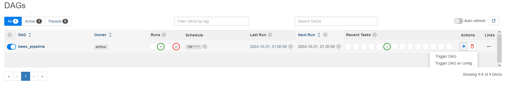
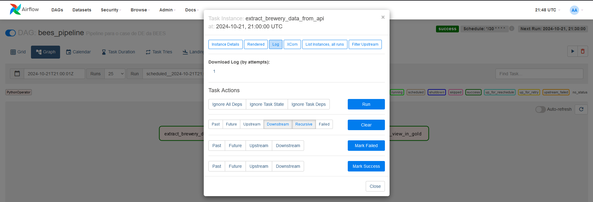

# Case DE BEES - Breweries
Este repositório contém uma solução para o case de data engineering da BEES. Um pipeline foi desenvolvido para extrair, transformar e carregar dados de cervejarias, tudo orquestrado pelo Apache Airflow.

### Estrutura do repositório

- **dags/**: Contém os DAGs do Airflow para orquestrar o pipeline de dados.
  
- **modules/**: 
  - **utils/**: Módulos utilitários usados no pipeline.
    - `EnvironmentVariables.py`: Define e gerencia variáveis de ambiente necessárias para o pipeline.
  - `extract_brewery_data.py`: Script responsável pela extração dos dados das cervejarias de uma API.
  - `load_tb_brewery_by_location.py`: Carrega os dados de cervejarias agregados por localização e tipo.
  - `transform_brewery_data.py`: Realiza a transformação dos dados extraídos, preparando-os para a fase de carregamento.
  - `brewery_pipeline.py`: É o arquivo que, de fato, cria o DAG, estabelecendo a ordem de execução de cada script.

- **data/**: Diretório onde os dados são armazenados durante a execução do pipeline (bronze, silver, gold). É uma pasta montada.

- **docs/**: Contém a documentação relacionada ao projeto.
  
- **tests/**: Scripts de teste para garantir a integridade do pipeline e seus módulos.

- **.env**: Arquivo de configuração do docker-compose do Airflow.

- **docker-compose.yml**: Arquivo de configuração docker-compose padrão do Apache Airflow.

- **Dockerfile**: Contém as instruções para a criação da imagem Docker personalizada para este projeto, incluindo a instalação de dependências e variáveis de ambiente.

- **requirements.txt**: Lista as dependências de Python necessárias.

# Como iniciar o Airflow
Para executar a solução, certifique-se que tenha o Docker instalado em sua máquina.
Ao clonar o repositório, você deverá acessá-lo pelo terminal e digitar o seguinte comando:
```
$ docker-compose build
```
Quando ele finalizar o build da imagem do container, ainda no terminal, execute:
```
$ docker-compose up -d
```
Este comando fará com que um container seja inicializado. Ao terminar a configuração inicial, acesse o seu navegador e digite em sua barra de endereços:
```
localhost:8080/
```
Para o case, o usuário e senha são o padrão:
```
usuário: airflow
```
```
senha: airflow
```
# Como executar o pipeline
Para iniciar o DAG, na página inicial, você irá ver o DAG como na imagem abaixo:

Clique no botão de **play** (actions) e em seguida clique em **Trigger DAG**, como na imagem abaixo.

Após isso, para se ter uma visão melhor da execução, você pode clicar em **bees_pipeline** e terá a visão de grafos, como na imagem abaixo:

É possível clicar em cada task e acompanhar o log durante a execução delas.
